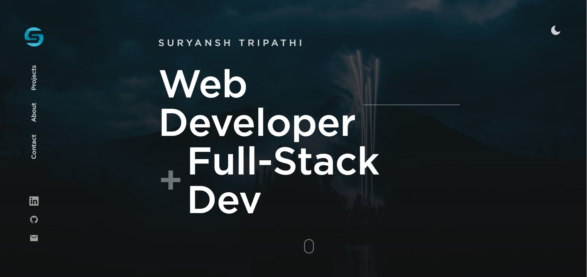

 
# [REACT-PORTFOLIO](https://suryansh-about.netlify.app/)

 A Beautiful portfolio web app template for developers built with react. Use it to showcase your work, testimonials, and other information to clients.
 
 ## [DEMO](https://suryansh-about.netlify.app/)
 
 ## DARK MODE
 
 
 
  ## LIGHT MODE 
   
 
  

### ABOUT

  

### PROJECT DETAILES

  

# INSTALLATION

Make sure you have nodejs and yarn installed. Install dependencies with:

`yarn `

Once it's done start up a local server with:

`yarn start`
